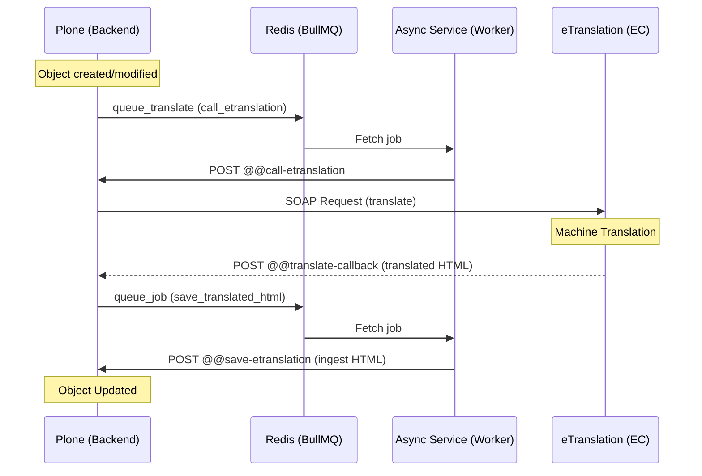

# Translation Process Documentation

This document describes the automatic translation workflow in `eea.climateadapt`, focusing on the core logic in `core.py` and the API views in `views.py`.

## Architecture Overview

The translation system is asynchronous and relies on:
1.  **Plone (Backend)**: Orchestrates the workflow and stores content.
2.  **eTranslation**: The European Commission's machine translation service (SOAP-based).
3.  **Async Translate Service (Node.js)**: Manages BullMQ queues to handle long-running tasks.
4.  **Converter Service**: Handles Volto blocks to HTML and HTML to Plone content conversions.

## Core Components (`core.py`)

### Job Queuing
- `queue_job(queue_name, job_name, data)`: Schedules a task for the external queue (Redis/BullMQ) at the end of the transaction.
- `queue_translate(obj, language)`: The entry point to start translating an object. It converts Volto blocks to HTML and queues the `call_etranslation` job.

### eTranslation Interaction
- `call_etranslation_service(html, obj_path, target_languages)`: Makes the actual SOAP call to eTranslation. It uses the `ETRANSLATION_SOAP_SERVICE_URL` and credentials configured in the environment.
- `destinations`: Configured to point back to the Plone site's `@@translate-callback`.

### Content Ingestion
- `ingest_html(trans_obj, html)`: The main logic for applying translated HTML back to a Plone object.
- `get_content_from_html(html, language)`: Calls the external converter service to transform HTML back into structured Plone data (including Volto blocks).
- `save_field_data(canonical, trans_obj, fielddata)`: Iterates over schemata and applies translated values to fields, respecting language-independent settings.

### Translation Management
- `setup_translation_object(canonical, language, request)`: Ensures a translation object exists in the correct path and is registered with the `TranslationManager`.
- `sync_translation_paths(...)`: Handles moving/renaming translations when the canonical (English) object is moved.

## API Views (`views.py`)

These views provide the interface for the Async Translate Service and eTranslation callbacks.

- `@@call-etranslation`: Called by the worker to trigger the SOAP call.
- `@@translate-callback`: The endpoint registered with eTranslation. It receives the translated HTML and queues it for saving.
- `@@save-etranslation` (via `SaveTranslationHtml` class): Called by the worker to finalise the ingestion of translated content into Plone.
- `@@tohtml`: Converts a Plone object's fields to a unified HTML representation suitable for translation. It uses the converter service for Volto blocks.
- `@@sync-translated-paths`: Interface to trigger path synchronization after move operations.

## Key Utilities

- `get_blocks_as_html(obj)`: Helper in `core.py` to extract Volto blocks as HTML via the converter service.
- `copy_missing_interfaces(en_obj, trans_obj)`: ensures behaviors and interfaces are consistent across translations.
- `sync_translation_state(trans_obj, en_obj)`: Synchronizes workflow state (e.g., Published) and effective dates.

## Security

Communication between the micro-services and Plone is protected by `TRANSLATION_AUTH_TOKEN`, checked via `check_token_security(request)`.
