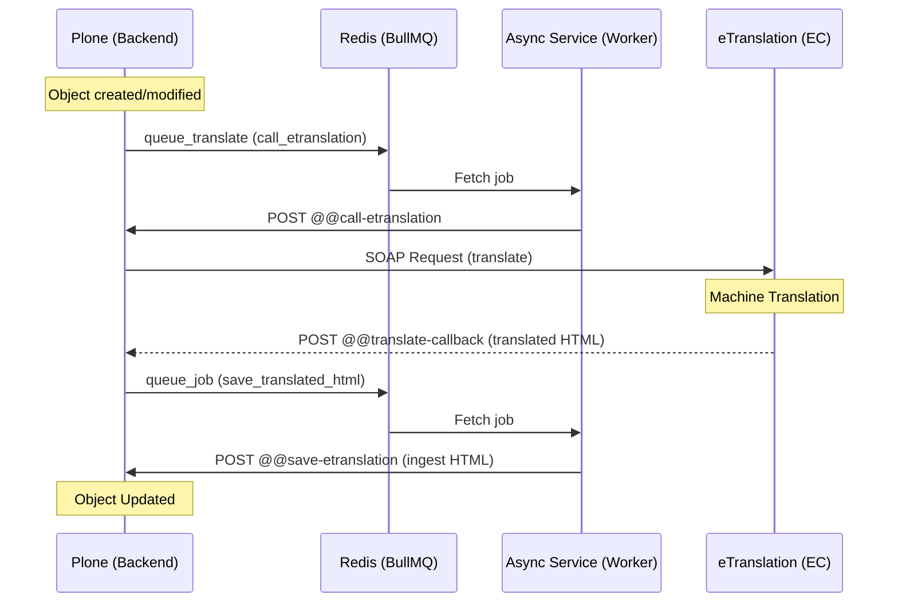

# Translation Process Documentation

This document describes the automatic translation workflow in `eea.climateadapt`, focusing on the core logic in `core.py` and the API views in `views.py`.

## Architecture Overview

The translation system is asynchronous and relies on:
1.  **Plone (Backend)**: Orchestrates the workflow and stores content.
2.  **eTranslation**: The European Commission's machine translation service (SOAP-based).
3.  **Async Translate Service (Node.js)**: Manages BullMQ queues to handle long-running tasks.
4.  **Converter Service**: Handles Volto blocks to HTML and HTML to Plone content conversions.

```mermaid
sequenceDiagram
    participant P as Plone (Backend)
    participant Q as Redis (BullMQ)
    participant W as Async Service (Worker)
    participant ET as eTranslation (EC)

    Note over P: Object created/modified
    P->>Q: queue_translate (call_etranslation)
    Q->>W: Fetch job
    W->>P: POST @@call-etranslation
    P->>ET: SOAP Request (translate)
    Note over ET: Machine Translation
    ET-->>P: POST @@translate-callback (translated HTML)
    P->>Q: queue_job (save_translated_html)
    Q->>W: Fetch job
    W->>P: POST @@save-etranslation (ingest HTML)
    Note over P: Object Updated
```

## Core Components (`core.py`)

### Job Queuing
- `queue_job(queue_name, job_name, data)`: Schedules a task for the external queue (Redis/BullMQ) at the end of the transaction.
- `queue_translate(obj, language)`: The entry point to start translating an object. It converts Volto blocks to HTML and queues the `call_etranslation` job.

### eTranslation Interaction
- `call_etranslation_service(html, obj_path, target_languages)`: Makes the actual SOAP call to eTranslation. It uses the `ETRANSLATION_SOAP_SERVICE_URL` and credentials configured in the environment.
- `destinations`: Configured to point back to the Plone site's `@@translate-callback`.

### Content Ingestion
- `ingest_html(trans_obj, html)`: The main logic for applying translated HTML back to a Plone object.
- `get_content_from_html(html, language)`: Calls the external converter service to transform HTML back into structured Plone data (including Volto blocks).
- `save_field_data(canonical, trans_obj, fielddata)`: Iterates over schemata and applies translated values to fields, respecting language-independent settings.

### Translation Management
- `setup_translation_object(canonical, language, request)`: Ensures a translation object exists in the correct path and is registered with the `TranslationManager`.
- `sync_translation_paths(...)`: Handles moving/renaming translations when the canonical (English) object is moved.

## API Views (`views.py`)

These views provide the interface for the Async Translate Service and eTranslation callbacks.

- `@@call-etranslation`: Called by the worker to trigger the SOAP call.
- `@@translate-callback`: The endpoint registered with eTranslation. It receives the translated HTML and queues it for saving.
- `@@save-etranslation` (via `SaveTranslationHtml` class): Called by the worker to finalise the ingestion of translated content into Plone.
- `@@tohtml`: Converts a Plone object's fields to a unified HTML representation suitable for translation. It uses the converter service for Volto blocks.
- `@@sync-translated-paths`: Interface to trigger path synchronization after move operations.

## Key Utilities

- `get_blocks_as_html(obj)`: Helper in `core.py` to extract Volto blocks as HTML via the converter service.
- `copy_missing_interfaces(en_obj, trans_obj)`: ensures behaviors and interfaces are consistent across translations.
- `sync_translation_state(trans_obj, en_obj)`: Synchronizes workflow state (e.g., Published) and effective dates.

## Security

Communication between the micro-services and Plone is protected by `TRANSLATION_AUTH_TOKEN`, checked via `check_token_security(request)`.

## Serial ID Mechanism (Conflict Resolution)

To prevent database conflicts and redundant translations when an object is modified multiple times in a short period, a "Serial ID" mechanism is used.

### Purpose
The Serial ID acts as a version counter for the object's content. It ensures that a translation job processed by the worker matches the *current* state of the object. If the object has been modified since the job was queued, the job is considered "stale" and is invalid.

### Components
1.  **`ISerialId` Interface** (`versions.py`): An integer annotation stored on the object.
2.  **Increment Subscriber** (`versions.zcml`): Listens for `IObjectModifiedEvent` and increments the object's `ISerialId` by 1.
3.  **Job Payload**: When `queue_translate` is called, the *current* `serial_id` is embedded in the job data (specifically in the `obj_path` query parameter).

### Validation Process
When the async worker picks up a `call_etranslation` job and calls back the Plone view `@@call-etranslation`:
1.  The view extracts the `serial_id` from the request.
2.  It retrieves the current `ISerialId` from the target object.
3.  **Check**: If `current_serial_id > job_serial_id`, the object has changed since the job was scheduled.
4.  **Action**: The job is skipped (returns a "skipped" status), preventing the eTranslation call and avoiding potential Write conflicts on the outdated content.

## Manual QA / Verification

This section details the steps to manually verify the robustness and correctness of the translation system, including recent safety fixes and async operations.

### Prerequisites

*   **Access to Logs**: You need to be able to see the Plone instance logs (e.g., `tail -f var/log/instance.log`) to verify async actions and error messages.
*   **Permissions**: An account with Editor or Manager privileges.

### 1. Basic Translation Workflow

**Goal**: Verify that creating content triggers translation and results appear in other languages.

1.  **Create Content**:
    *   Go to an English folder (e.g., `/en/test-folder`).
    *   Create a new **Page** named `qa-basic-test`.
    *   Add some text and Save.
2.  **Trigger Translation (if not automatic)**:
    *   If automatic translation is disabled, use the "Translate" menu to request translation to `de` (German).
3.  **Wait**:
    *   The process is asynchronous. It may take a few minutes depending on queue depth.
4.  **Verify**:
    *   Switch to German language or navigate to `/de/test-folder/qa-basic-test`.
    *   Check that the page exists and content is translated (or at least present).

### 2. Async Translation Deletion

**Goal**: Ensure that deleting a canonical (English) object correctly removes all its linked translations.

1.  **Setup**:
    *   Ensure you have a content object with existing translations (e.g., use the `qa-basic-test` from above).
    *   Verify `/de/test-folder/qa-basic-test` exists.
2.  **Action**:
    *   Delete the **English** object `/en/test-folder/qa-basic-test`.
3.  **Observe Logs**:
    *   Look for the log message: `Queued async deletion for X translations of ...`
    *   Followed shortly by: `Async deleted translation: ...`
4.  **Verify**:
    *   Try to access `/de/test-folder/qa-basic-test`. It should return a 404 Not Found.

### 3. Safety: Object Replacement (UID Verification)

**Goal**: Verify that the system detects if an object has been replaced (deleted and recreated with same ID) while a job was pending, preventing data corruption.

1.  **Setup**:
    *   Create a Page `/en/qa-safety-test`.
    *   **Crucial**: You need to intercept or delay the translation job. If testing locally, you can stop the async worker (Node.js service) *before* creating the page, or simply be very fast.
    *   Trigger translation.
2.  **Action (The "Replacement")**:
    *   Delete `/en/qa-safety-test`.
    *   Immediately create a *new* Page with the **same ID** `/en/qa-safety-test`.
    *   (This new object has a different UUID than the one in the pending job).
3.  **Resume**:
    *   Start the worker or allow the job to proceed.
4.  **Observe Logs**:
    *   The system should **not** write translation data to the new object.
    *   Look for a warning: `Skipping translation for ...: UID mismatch (object replaced)` or `object_replaced`.

### 4. Safety: Structural Conflict Resolution

**Goal**: Verify valid handling when a translation path is blocked by a different type of object (e.g., a Folder replaced by a Page).

1.  **Setup (The Conflict)**:
    *   Create a **Folder** in German at `/de/conflict-test` (manually).
    *   Add a child object inside it: `/de/conflict-test/child-doc`.
2.  **Action**:
    *   Create a **Page** (not Folder) in English at `/en/conflict-test`.
    *   Trigger translation for this English Page.
3.  **Expectation**:
    *   The Translation ID Chooser sees the path `/de/conflict-test` is taken by a Folder, but we are translating a Page.
    *   It cannot overwrite the Folder (it has children).
    *   **Resolution**: It should rename the old folder and create the new Page.
4.  **Verify**:
    *   Check `/de/conflict-test` is now a **Page** (the new translation).
    *   Check the old folder exists as `/de/conflict-test-orphaned-...`.
    *   (Note: Children of the orphaned folder are queued for reliable migration to the new structure if applicable, or remain in the orphaned folder).
